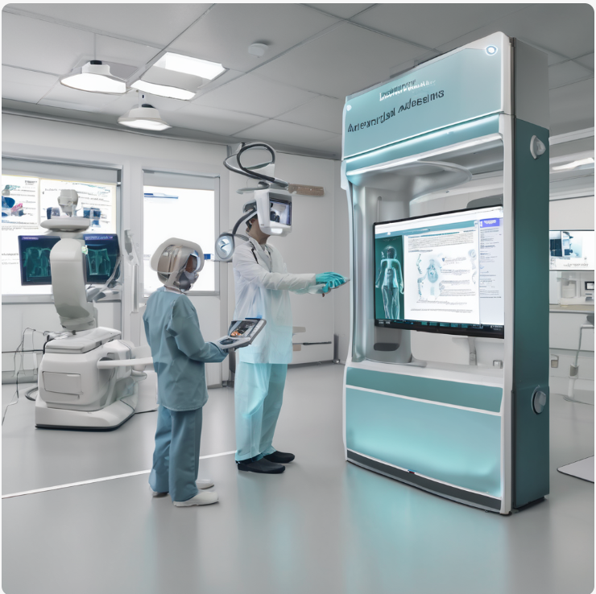
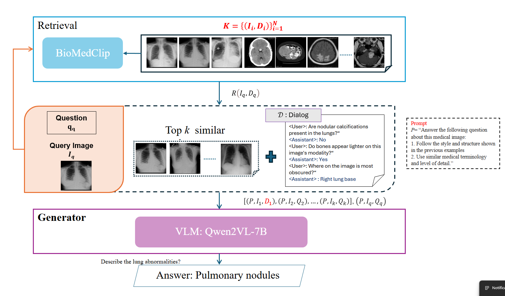

<p align="center">
  
</p>


# RAG-VQAMed: Stylistic Multi-Image Context Fusion for Retrieval-Augmented Medical Visual Question Answering 

Yakoub Bazi, lulua Hussin, Mohamad Al rahhal, Mansour Zuair


[[Paper]()] [[RAG-VQAMed]()] 

<br>

## Content 📒
- [Latest Updates](#latest-updates)
- [Architecture](#architecture)
- [Demo](#demo)
- [RS-Instructions Dataset](#rs-instructions-dataset)
- [Training](#training)
- [Acknowledgements](#acknowledgements)
- [Citation](#citation)

---

## Latest Updates  
- 📔 24 Feb 2025: We are excited to announce the publication of the paper [**RAG-VQAMed: Stylistic Multi-Image Context Fusion for Retrieval-Augmented Medical Visual Question Answering **](under review).


## Architecture
<p align="center">
  
</p>

---


## Acknowledgements
+ [LLaVA](https://github.com/haotian-liu/LLaVA): an open-sourced model for vision-language assistant.

---

## Citation

If you find RS-LLaVa useful in your research or application, please consider citing using the following BibTeX:

```bibtex
@Article{rs16091477,
AUTHOR = {Bazi, Yakoub and Bashmal, Laila and Al Rahhal, Mohamad Mahmoud and Ricci, Riccardo and Melgani, Farid},
TITLE = {RS-LLaVA: A Large Vision-Language Model for Joint Captioning and Question Answering in Remote Sensing Imagery},
JOURNAL = {Remote Sensing},
VOLUME = {16},
YEAR = {2024},
NUMBER = {9},
ARTICLE-NUMBER = {1477},
URL = {https://www.mdpi.com/2072-4292/16/9/1477},
ISSN = {2072-4292},
DOI = {10.3390/rs16091477}
}

```
---
